# Component Architecture

**Version:** 0.3.0b1
**Last Updated:** 2026-06-07 (updated: rec 1.2 task page, SSE protocol, route map)

---

## Factory System (`adgtk.factory`)

The factory is the central registry for all pluggable components. It is **non-persistent** — rebuilt from scratch on every process start via `bootstrap.py`.

### Structure

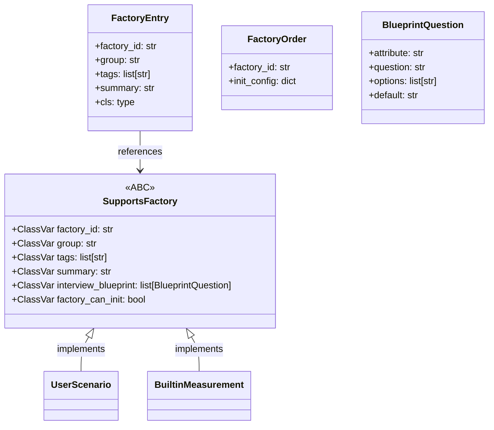

### Global Registry

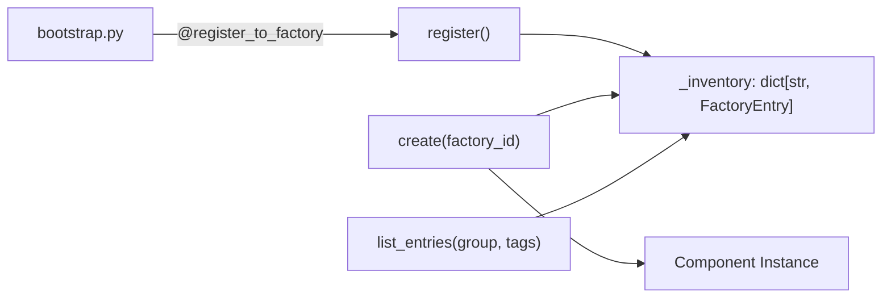

### Registration Lifecycle

Every process that runs an ADGTK command calls `run_bootstrap()`, which invokes three ordered hooks from the project's `bootstrap.py`:

1. `foundation()` — Register built-in language primitives and core framework types
2. `builtin()` — Register framework-provided scenarios, measurements, and datasets
3. `user_code()` — Register user-defined components

After bootstrap, the `_inventory` dict is fully populated and all subsequent `create()` calls resolve synchronously without I/O.

---

## Experiment System (`adgtk.experiment`)

### Class Relationships

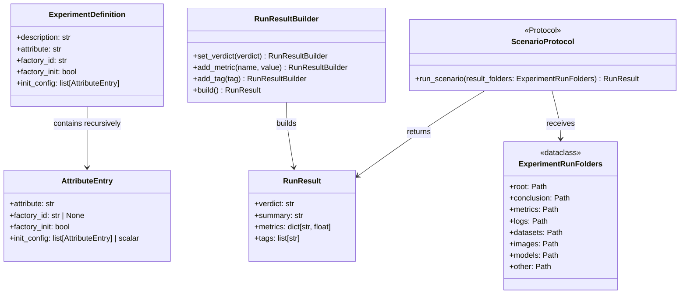

### Experiment Build Process

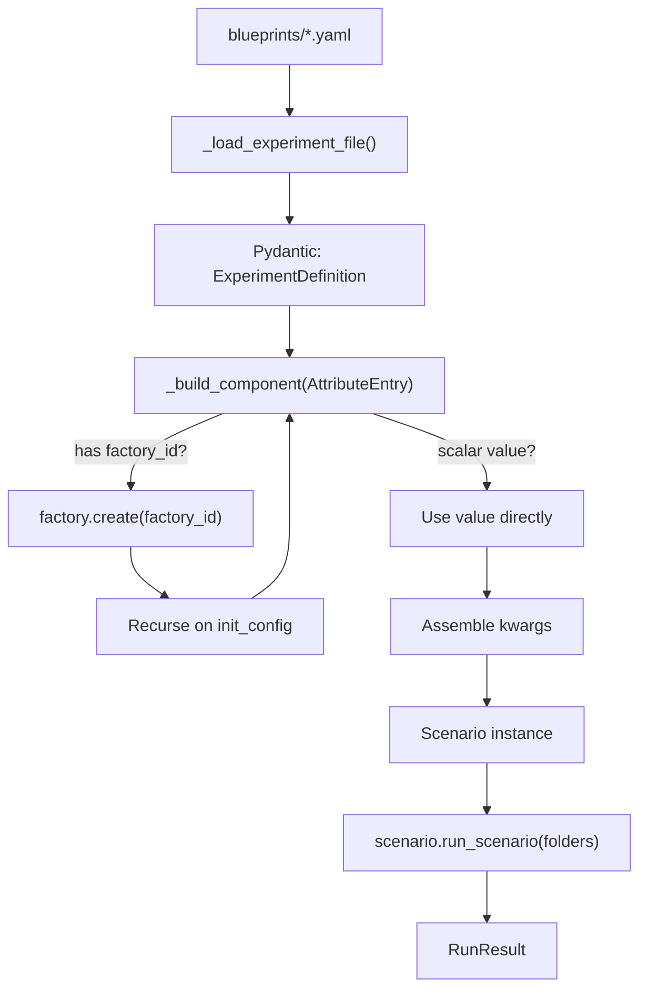

---

## Tracking & Observations (`adgtk.tracking`)

### Observation Types

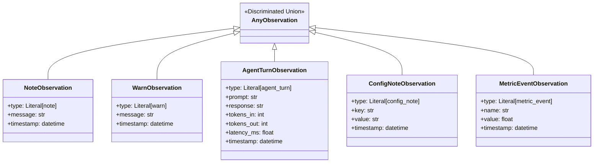

### Run Manifest Structure

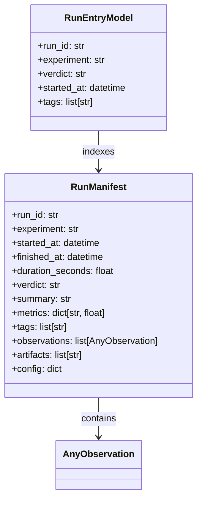

### Module-Level State

The tracking module uses module-level globals to accumulate run data during execution. This avoids passing context objects through every layer of user code.

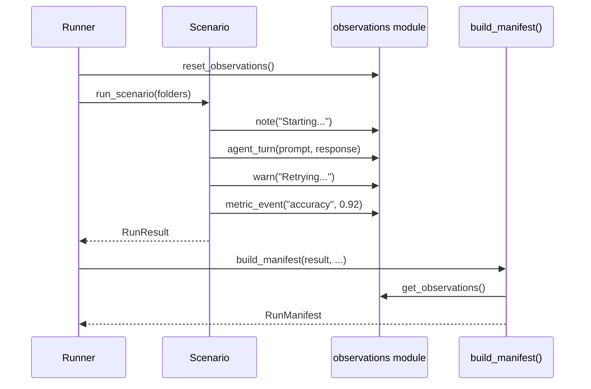

---

## Measurements (`adgtk.measurements`)

### Engine Architecture

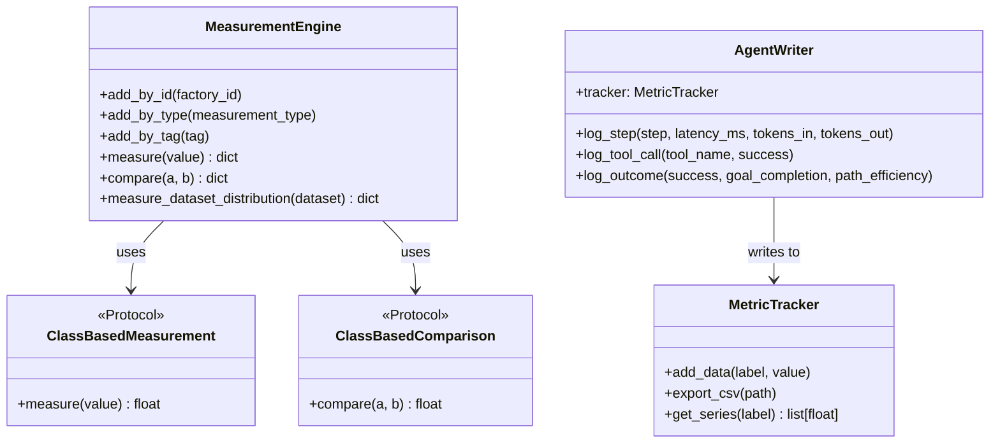

### Built-in Measurements

| Factory ID | Type | Description |
|-----------|------|-------------|
| `string-length` | measurement | Character count of a string |
| `dict-total-str-length` | measurement | Recursive string length across a dict |
| `exact-match` | comparison | Binary string equality (0.0 or 1.0) |
| `token-f1` | comparison | Word-overlap F1 score |
| `json-valid` | measurement | Returns 1.0 if string is valid JSON |
| `dict-schema-match` | comparison | Key overlap ratio between two dicts |
| `schema-key-depth` | measurement | Maximum nesting depth of a dict |
| `list-item-type-consistency` | measurement | Homogeneity ratio of a list's types |

### AgentWriter Metrics

`AgentWriter` is a high-level instrumentation layer designed specifically for evaluating agentic systems. It emits named metrics into a `MetricTracker` using semantic, domain-appropriate names.

| Metric Name | Description |
|------------|-------------|
| `agent.latency_ms` | Per-step call latency |
| `agent.tokens_in` | Input tokens per step |
| `agent.tokens_out` | Output tokens per step |
| `agent.success` | Step success flag (0/1) |
| `agent.retry_count` | Number of retries |
| `agent.tool_calls` | Total tool calls in step |
| `agent.goal_completion` | Final goal completion score |
| `agent.path_efficiency` | Ratio of optimal steps to actual steps |

---

## Logging System (`adgtk.utils.logs`)

ADGTK maintains four loggers with distinct scopes. All are created through `create_logger()` or its specialised wrappers.

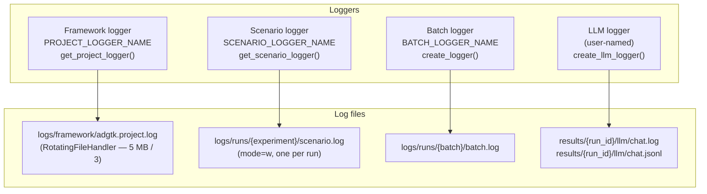

### Logger constants (`adgtk.utils.defaults`)

| Constant | Value | Purpose |
|----------|-------|---------|
| `PROJECT_LOGGER_NAME` | `"adgtk.project.log"` | Framework / runner lifecycle events |
| `SCENARIO_LOGGER_NAME` | `"SCENARIO"` | Per-run scenario output |
| `BATCH_LOGGER_NAME` | `"BATCH"` | Batch run summary |
| `LOG_ROTATE_MAX_BYTES` | `5_000_000` | Rotation threshold for framework logs |
| `LOG_ROTATE_BACKUP_COUNT` | `3` | Number of backup files kept |

### Project context guard

`get_project_logger()` calls `is_project_context()` before creating any file handler. `is_project_context()` returns `True` only when `bootstrap.py` is present in the CWD. Outside a project directory the logger is returned with a `NullHandler` — no `logs/` tree is created in unexpected locations.

### LLM logger dual output

`create_llm_logger()` attaches two file handlers to the same logger:

1. `RoleColorFormatter` → `.log` file — ANSI-colored role labels for terminal use
2. `NdjsonFormatter` → `.jsonl` file — `{"role":"..","content":"..","ts":".."}` per line, consumed by the web run-detail Logs tab

---

## CLI (`adgtk.cli`)

Nine independent CLI entry points share a common bootstrap invocation pattern:

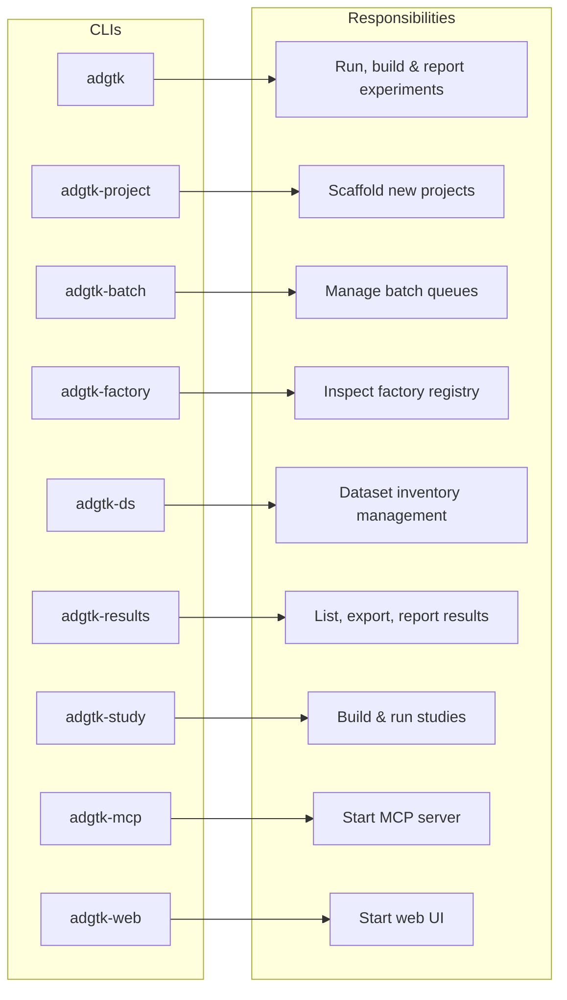

---

## Web Interface (`adgtk.api`)

### Request / Response Architecture

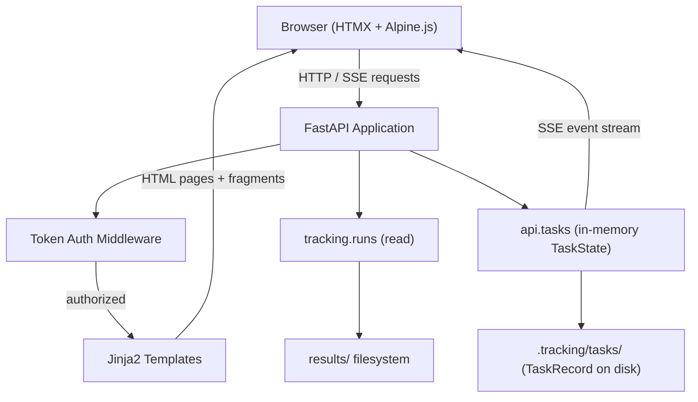

The web UI uses HTMX for partial-page updates, keeping the server-side rendering model while achieving dynamic UX without a JavaScript framework.

### Task Tracking Layer

Every long-running operation (experiment run, batch, etc.) produces two objects:

- **`TaskState`** (`api/tasks.py`) — in-memory only. Holds the live subprocess handle, buffered output lines for SSE streaming, and a reference to the `TaskRecord`. Exists only while the server is running.
- **`TaskRecord`** (`experiment/task_record.py`) — Pydantic model persisted to `.tracking/tasks/{task_id}/record.json`. Survives server restarts. Includes `run_id` once the run completes.

**Retention and cleanup** — `task_record.py` provides two cleanup functions that are called at web-server startup (if `auto_cleanup` is enabled in `settings.yaml`) and from the `adgtk tasks cleanup` CLI command:

- `purge_old_task_records(max_age_days, max_count)` — two-pass cleanup: first removes finished tasks older than the TTL, then trims to the count cap (oldest first). Running tasks are never deleted.
- `delete_finished_task_records()` — removes all completed/error/stopped task directories regardless of age (used by the manual "Cleanup" button in the web UI).

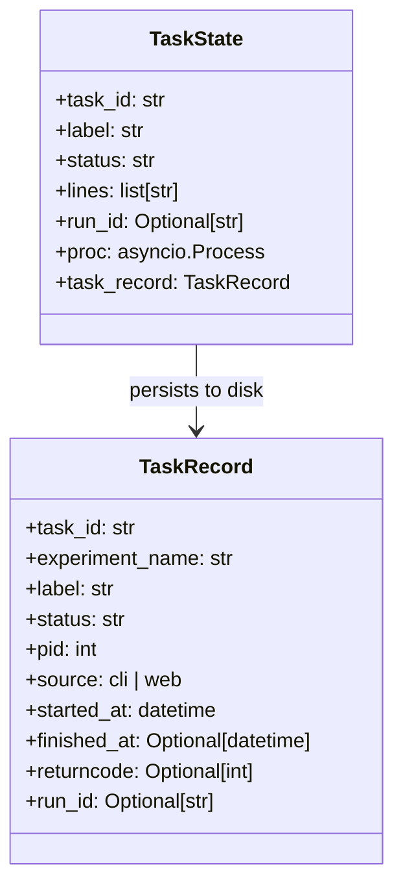

### Run Page Lifecycle (web-initiated experiment)

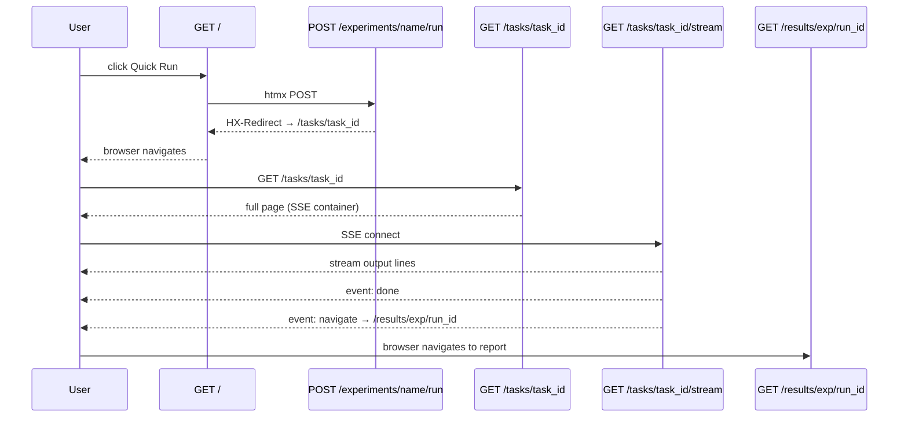

### SSE Event Protocol

The `/tasks/{task_id}/stream` endpoint emits three event types:

| Event | When | Data |
|-------|------|------|
| `message` (default) | Each captured output line | HTML `<div>` with escaped line |
| `done` | Task terminal state | HTML status badge (complete / error) |
| `navigate` | Complete + `run_id` known | Report URL `/results/{exp}/{run_id}` |
| `dashboardRefresh` | Any terminal state | empty — triggers dashboard list reload |

### Dashboard Refresh

The active-task indicator polls `/tasks/active-indicator` every 3 seconds. When no tasks are running, the response includes `HX-Trigger: dashboardRefresh`. The dashboard "Recent runs" card listens for this event (`hx-trigger="dashboardRefresh from:body"`) and re-fetches `/dashboard/recent-runs` to show the latest completed run without a full-page reload.

### Route Map

**Dashboard**

| Method | Path | Response |
|--------|------|----------|
| GET | `/` | Dashboard home page |
| GET | `/dashboard/recent-runs` | Recent runs list partial |
| GET | `/dashboard/stats` | Experiment/run count stats partial |

**Logs**

| Method | Path | Response |
|--------|------|----------|
| GET | `/logs` | Log browser page (grouped by category) |
| GET | `/logs/raw` | Raw log file text (`?file=<key>`) |

**Experiments**

| Method | Path | Response |
|--------|------|----------|
| POST | `/experiments/{name}/run` | `HX-Redirect: /tasks/{task_id}` |

**Tasks**

| Method | Path | Response |
|--------|------|----------|
| GET | `/tasks` | Full task list page |
| POST | `/tasks/cleanup` | Task list page (all finished removed) |
| GET | `/tasks/active-indicator` | Sidebar running-task indicator partial |
| GET | `/tasks/{task_id}` | Full task detail page |
| GET | `/tasks/{task_id}/stream` | SSE stream (text/event-stream) |
| POST | `/tasks/{task_id}/stop` | Updated active-indicator partial |

**Results**

| Method | Path | Response |
|--------|------|----------|
| GET | `/results` | Experiment list page |
| GET | `/results/{experiment}` | Runs list + report + journal tabs |
| POST | `/results/{experiment}/report` | Regenerated report HTML partial |
| GET | `/results/{experiment}/journal` | Journal entries partial |
| POST | `/results/{experiment}/journal` | Add entry; returns updated partial |
| DELETE | `/results/{experiment}/journal/{id}` | Delete entry; returns updated partial |
| GET | `/results/{experiment}/{run_id}` | Run detail page |
| GET | `/results/{experiment}/{run_id}/notes` | Researcher notes partial |
| POST | `/results/{experiment}/{run_id}/notes` | Add note; returns updated partial |
| DELETE | `/results/{experiment}/{run_id}/notes/{id}` | Delete note; returns updated partial |
| GET | `/results/{experiment}/{run_id}/images/{file}` | Serve run image file |
| GET | `/results/{experiment}/{run_id}/lograw` | Raw log text (scenario / llm) |
| GET | `/results/{experiment}/{run_id}/artifact` | Artifact preview page |
| GET | `/results/{experiment}/{run_id}/artifact/download` | Artifact file download |
| POST | `/results/sync` | Sync registry with disk; returns updated table |
| POST | `/results/validate` | Registry integrity check partial |

**Settings**

| Method | Path | Response |
|--------|------|----------|
| GET | `/settings` | Settings page |
| POST | `/settings` | Save settings; returns updated settings page |

---

## Settings System (`adgtk.utils.project_settings`)

User-configurable project settings are stored in `settings.yaml` at the project root. The file is created with defaults on first access, so no explicit migration step is needed when new settings are added.

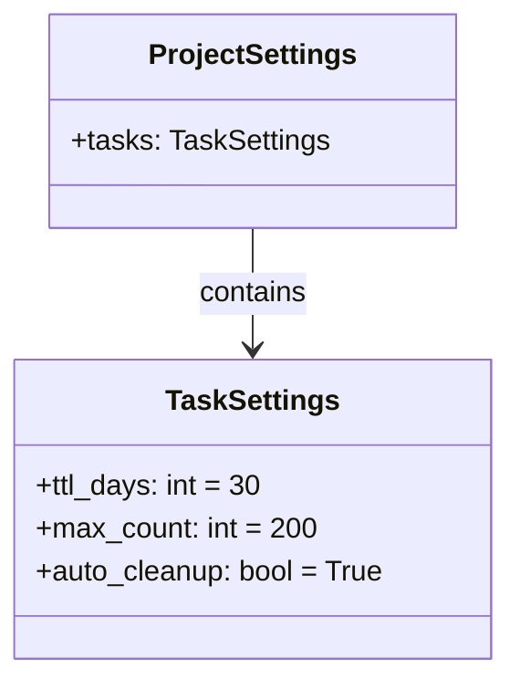

### `TaskSettings` fields

| Field | Default | Description |
|-------|---------|-------------|
| `ttl_days` | `30` | Delete finished task directories older than this many days |
| `max_count` | `200` | Keep at most this many task directories on disk |
| `auto_cleanup` | `True` | Run TTL + count cleanup automatically at web-server startup |

### Auto-cleanup lifecycle

At web-server startup (`adgtk-web`), after `run_bootstrap()`:

1. `cleanup_orphaned_tasks()` — mark any "running" tasks whose PID is dead as "error"
2. If `auto_cleanup` is `True`, call `purge_old_task_records(ttl_days, max_count)` to enforce the retention policy

The same cleanup can be triggered from the CLI:

```bash
adgtk tasks cleanup --auto   # apply TTL/count from settings.yaml
adgtk tasks cleanup          # delete ALL finished task records
```

---

## MCP Server (`adgtk.mcp_server`)

The MCP server exposes ADGTK capabilities as tools consumable by Claude and other MCP-compatible agents.

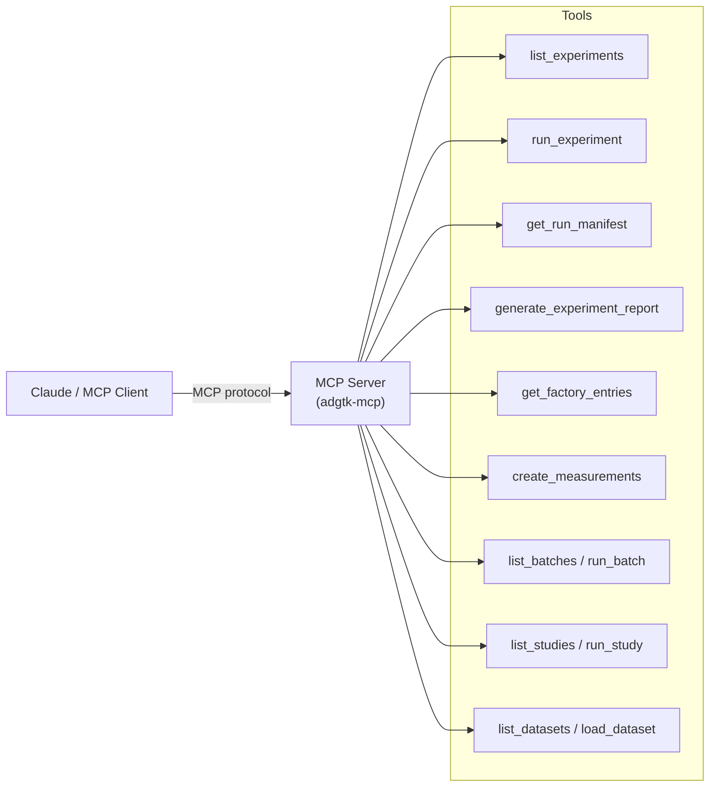

This enables agent-driven experiment orchestration: an AI agent can discover available experiments, run them, retrieve results, and adapt its strategy — all through the MCP protocol without human intervention.

---

## Data System (`adgtk.data`)

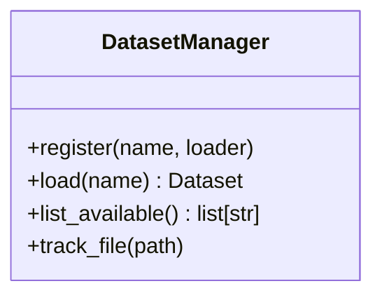

Supports HuggingFace `datasets` library as the primary dataset format, with file tracking to copy referenced datasets into the run's `datasets/` subfolder for reproducibility.

---

## Related Documents

- [System Overview](overview.md)
- [Data Flow](data-flow.md)
- [Decisions Index](decisions/index.md)
