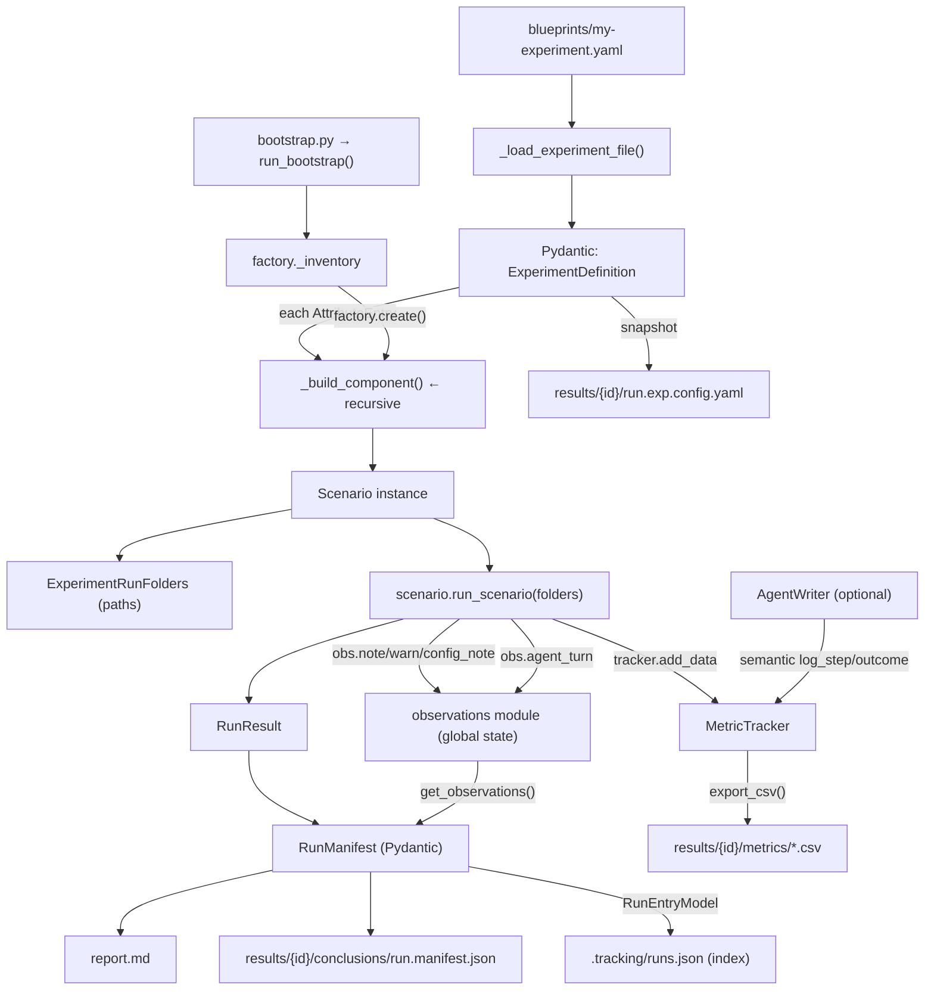
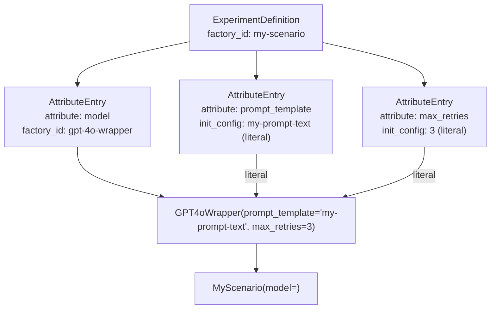
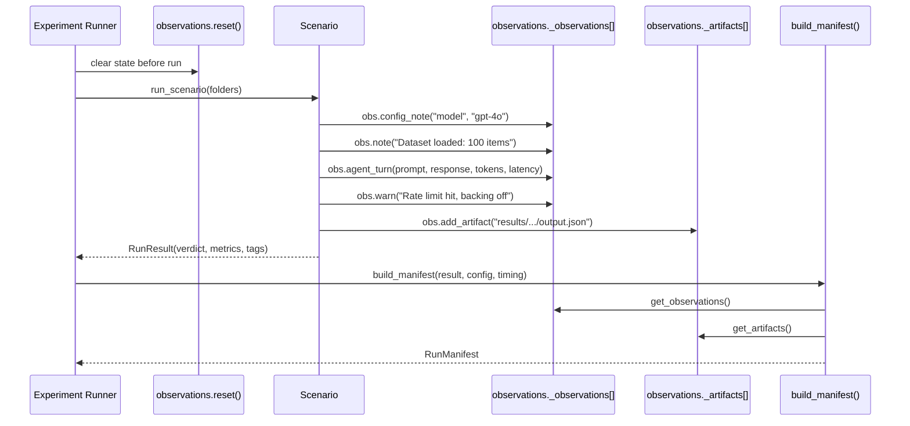
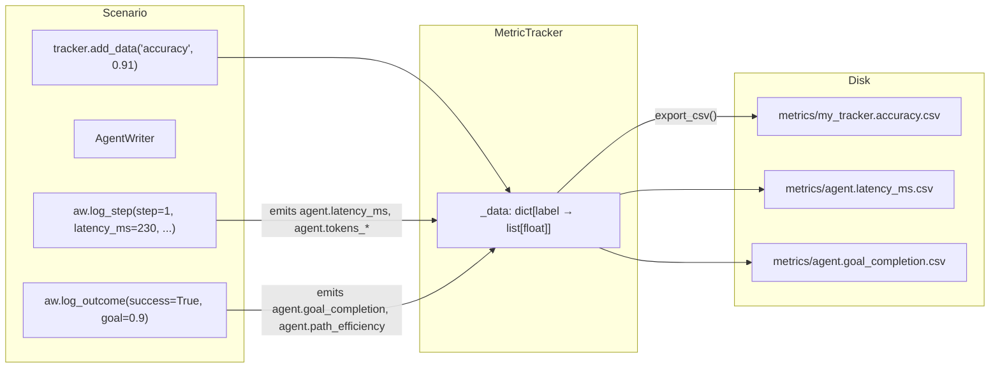
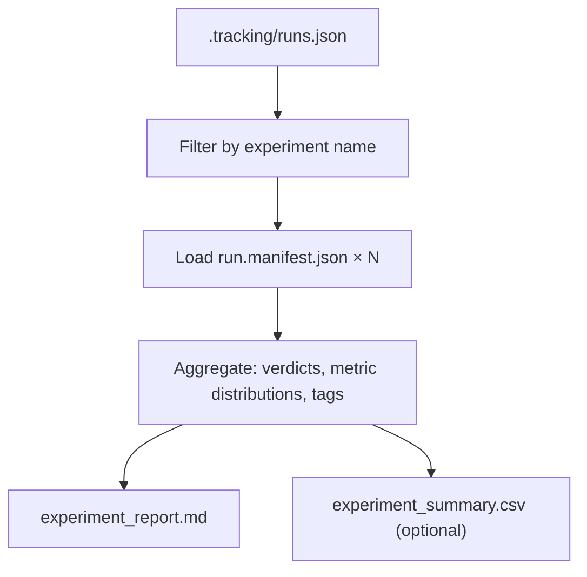
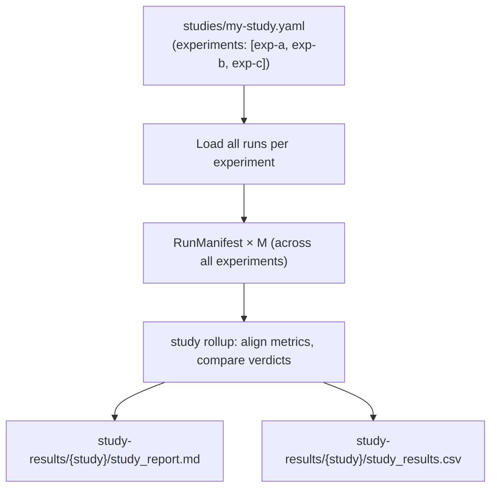
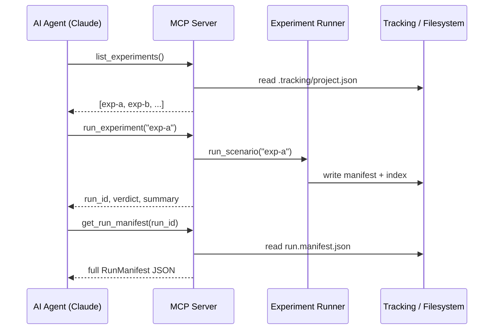
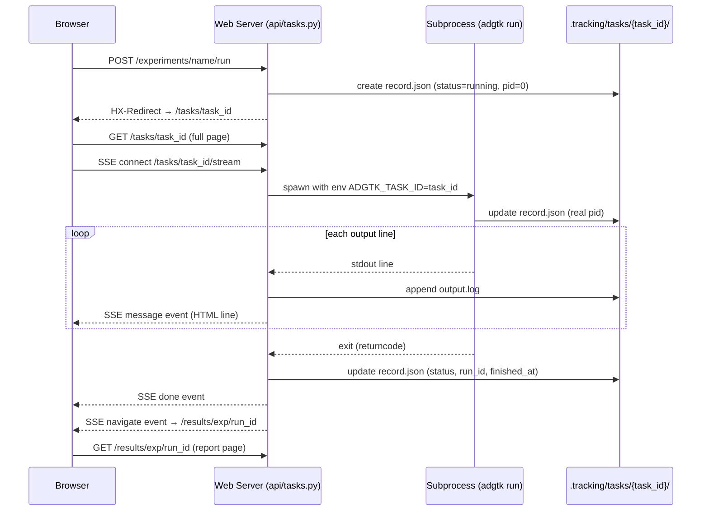
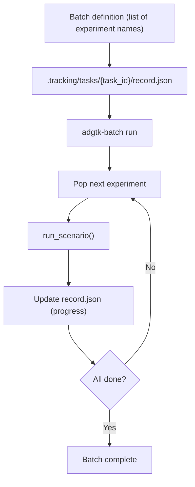
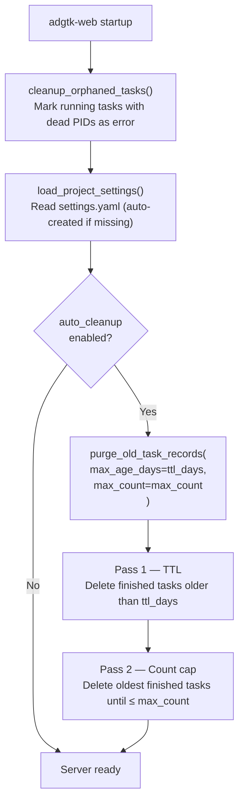

# Data Flow

**Version:** 0.3.0b1
**Last Updated:** 2026-06-07 (updated: rec 1.2 web-initiated run flow; batch section updated to ADR-009)

---

## Overview

Data in ADGTK flows in one primary direction: **definition → execution → observation → persistence**. This document traces how data moves from YAML blueprint to disk-persisted manifest, and how results are aggregated across runs and experiments.

---

## Primary Execution Flow

---

## Configuration Resolution

Blueprint YAML uses a recursive `AttributeEntry` structure. Each node is either a **factory-backed component** or a **literal value**. Resolution is depth-first.

---

## Observation Accumulation

During a run, the scenario (and any components it calls) writes observations into a module-level list. This list is reset before each run and consumed by `build_manifest()` at the end.

---

## Metrics Data Flow

Metrics follow two paths: **direct** (via `MetricTracker`) and **semantic** (via `AgentWriter`, which wraps `MetricTracker`).

Each label in a `MetricTracker` becomes a separate CSV file. Rows represent values over time (across steps or iterations within a single run).

---

## Results Aggregation: Experiment Report

After multiple runs of the same experiment, `generate_experiment_report()` aggregates across all `RunManifest` records.

---

## Results Aggregation: Study Rollup

A study groups multiple experiments for cross-experiment comparison.

---

## MCP-Driven Data Flow

When an AI agent drives experiments via the MCP server, the flow is the same internally — the MCP layer is a thin adapter over the same runner and tracking APIs.

---

## Web-Initiated Run Flow

When a run is started from the web UI, the flow diverges from the CLI path. The web server creates a `TaskState` and `TaskRecord` before launching the subprocess, then streams live output to the browser via SSE.

After the run completes, `_find_run_id()` in `api/tasks.py` scans `results/{experiment_name}/` for the directory with the newest modification time since the task started, and stores it as `task.run_id` / `TaskRecord.run_id`.

---

## Batch Execution Flow

The batch system sequences multiple experiments. Task state is written to `.tracking/tasks/{task_id}/record.json` (ADR-009).

---

## Task Retention Flow

At web-server startup (and optionally from the CLI), finished task directories are pruned according to the project's `settings.yaml` retention policy.

Running tasks are never deleted by either cleanup pass. The same policy can be applied manually from the CLI with `adgtk tasks cleanup --auto`, or all finished records can be removed at once with `adgtk tasks cleanup` (prompts for confirmation) or the **Cleanup** button in the web UI's Tasks page.

---

## Related Documents

- [System Overview](overview.md)
- [Component Architecture](components.md)
- [Decisions Index](decisions/index.md)
