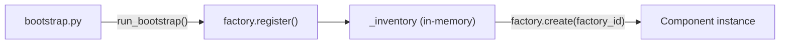

# ADR-001: Non-Persistent Factory Registry

**Status:** Accepted
**Date:** 2026-06-07

---

## Context

ADGTK needs a mechanism for users to register custom scenarios, measurements, and datasets so that experiment blueprints can reference them by a stable string identifier (`factory_id`). Options include:

- A database or config file that persists registrations between runs
- A plugin discovery mechanism (e.g., setuptools entry points)
- An in-memory registry rebuilt from user code on every process start

The framework targets researchers who iterate rapidly on their scenario implementations and frequently add, rename, or remove components.

---

## Decision

Use a **non-persistent, in-memory global registry** (`_inventory: dict[str, FactoryEntry]`) that is rebuilt from scratch on every process start via a structured bootstrap call sequence.

---

## Rationale

- **No stale state.** Since components are Python classes, any rename or removal takes effect on the next run without requiring a registry cleanup step.
- **Debuggable.** The full set of registered components can be inspected with `adgtk-factory list` at any time, and the registration source is always `bootstrap.py`.
- **Simple dependency model.** No database, no file lock, no migration scripts. Components are just Python code.
- **Fast startup.** Bootstrap is three function calls; registration is dict insertion. Startup overhead is negligible.

---

## Alternatives Considered

| Alternative | Why Rejected |
|-------------|-------------|
| Persistent file/database registry | Stale entries after renames; requires sync logic; adds complexity |
| Setuptools entry points | Requires installing the package in editable mode for every iteration; too slow for research iteration |
| Auto-discovery via filesystem scan | Non-deterministic ordering; difficult to control registration scope |

---

## Consequences

- **Positive:** Zero-config component addition — implement a class, register it in `bootstrap.py`, reference it in YAML.
- **Positive:** Factory state is always authoritative; no cache invalidation needed.
- **Negative:** Every process must run bootstrap before any factory operation. Long-running services (web, MCP) bootstrap once at startup.
- **Negative:** No cross-process registry sharing without re-bootstrapping. This is acceptable because each run is independent.

---

## Related Decisions

- [ADR-008](ADR-008-bootstrap-pattern.md) — Bootstrap hook ordering
- [ADR-002](ADR-002-yaml-blueprints.md) — How factory IDs are referenced in blueprints
