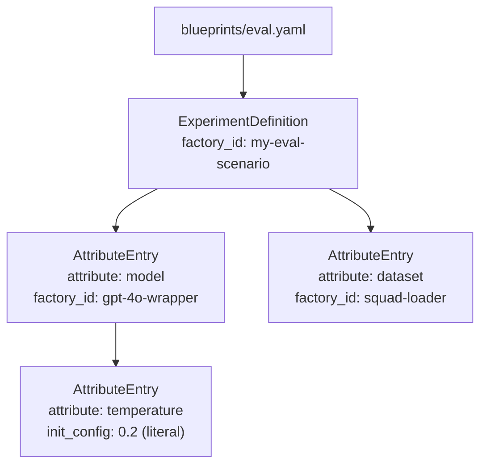

# ADR-002: YAML-Based Experiment Blueprints

**Status:** Accepted
**Date:** 2026-06-07

---

## Context

Experiments need to be defined in a way that is:

- Readable and editable by researchers without writing Python
- Reproducible — the exact configuration used in a run should be snapshotable
- Expressive enough to handle recursive component composition (a scenario that contains a model that contains a prompt)
- Version-controllable alongside code

---

## Decision

Experiment configurations are stored as **YAML files** in a `blueprints/` directory. They follow a recursive `AttributeEntry` schema where each node either references a factory-registered component (`factory_id`) or specifies a literal value.

```yaml
description: "Evaluate GPT-4o on task X"
attribute: scenario
factory_id: my-eval-scenario
factory_init: true
init_config:
  - attribute: model
    factory_id: gpt-4o-wrapper
    factory_init: true
    init_config:
      - attribute: temperature
        init_config: 0.2
  - attribute: dataset
    factory_id: squad-loader
    factory_init: true
    init_config: []
```



A **snapshot** of the resolved YAML is written to `results/{run_id}/run.exp.config.yaml` at the start of each run to ensure reproducibility.

---

## Rationale

- **Human-readable.** Researchers can read, write, and diff experiment configs without Python knowledge.
- **Version controllable.** YAML files in `blueprints/` can be committed alongside scenario code and evolve with it.
- **Snapshotable.** Because the config is a plain file, copying it next to results is trivial and unambiguous.
- **Recursive composition.** The `AttributeEntry` structure naturally handles arbitrarily deep component trees.
- **Validated at load time.** Pydantic parses the YAML into `ExperimentDefinition`, catching structural errors before any experiment runs.

---

## Alternatives Considered

| Alternative | Why Rejected |
|-------------|-------------|
| Python config files (e.g., dict literals) | Require Python knowledge; not safely diffable; exec-based loading creates security surface |
| TOML | Less support for nested structures; less familiar in ML research tooling |
| JSON | Verbose, no comments, harder to write by hand |
| Programmatic experiment definition | Harder to snapshot; requires running code to inspect configuration |

---

## Consequences

- **Positive:** Experiments can be shared, versioned, and reproduced by anyone with the codebase.
- **Positive:** The recursive `AttributeEntry` schema handles arbitrarily complex component trees.
- **Negative:** Adding a new experiment requires creating a YAML file; no pure-Python experiment definition path exists. (The `adgtk build` CLI wizard mitigates this.)
- **Negative:** Recursive YAML structures can become verbose for deeply nested components.

---

## Related Decisions

- [ADR-001](ADR-001-non-persistent-factory.md) — Factory registry that `factory_id` references resolve against
- [ADR-004](ADR-004-pydantic-validation.md) — Pydantic validation of the YAML schema
- [ADR-003](ADR-003-filesystem-tracking.md) — Where snapshots are stored
