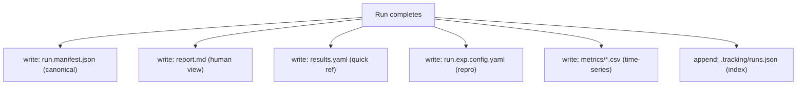

# ADR-003: Filesystem-Based Result Tracking

**Status:** Accepted
**Date:** 2026-06-07

---

## Context

Each experiment run produces: structured metrics, a verdict, a natural-language summary, a full observation log, and the config snapshot used. This data needs to be:

- Persisted durably across runs
- Queryable (list runs, filter by experiment, compare verdicts)
- Portable (shareable without database export)
- Auditable (human-readable without tooling)

---

## Decision

All run data is stored as **plain files on the local filesystem**. A lightweight JSON index (`.tracking/runs.json`) enables fast querying without a database.

```
{experiment-name}/{run_id}/
├── run.exp.config.yaml        ← config snapshot (reproducibility)
├── conclusion/
│   ├── run.manifest.json      ← canonical source of truth (Pydantic RunManifest)
│   ├── report.md              ← human-readable Markdown report
│   └── results.yaml           ← quick-reference verdict + metrics
└── metrics/
    └── {tracker}.{label}.csv  ← one CSV per metric label (time-series)

.tracking/
├── runs.json                  ← lightweight index (run_id, experiment, verdict, timestamp)
├── project.json               ← experiment inventory
└── tasks/                     ← per-task directories (see ADR-009)
    └── {task_id}/
        ├── record.json        ← TaskRecord (status, pid, timestamps)
        └── output.log         ← captured stdout/stderr
```



The `run.manifest.json` is the **canonical source of truth**. All other files (`report.md`, `results.yaml`) are derived from it and can be regenerated.

---

## Rationale

- **No infrastructure dependency.** Researchers can run experiments on a laptop, an HPC cluster, or a cloud VM without provisioning a database.
- **Portable and shareable.** Results directories can be zipped and shared; any ADGTK installation can inspect them.
- **Human-readable.** `report.md` and `results.yaml` are readable without any tooling. This is important for quick inspection during research.
- **Git-compatible.** Results can optionally be committed (for small experiments) or `.gitignore`d (for large ones) — either workflow is natural.
- **Notebook-friendly.** CSV metrics can be loaded directly by pandas in a Jupyter notebook with a single `pd.read_csv()`.
- **Index is sufficient.** For the scale of experiments typical in research (hundreds to low thousands of runs), a flat JSON index is fast enough for all queries.

---

## Alternatives Considered

| Alternative | Why Rejected |
|-------------|-------------|
| SQLite database | Requires schema migrations; binary file not directly diffable; adds complexity for no gain at research scale |
| PostgreSQL / external database | Requires infrastructure; defeats portability goal |
| MLflow / Weights & Biases | External service dependency; overkill for framework-level tracking; researchers may prefer different tools for visualization |
| Pickle / binary formats | Not human-readable; not portable across Python versions |

---

## Consequences

- **Positive:** Zero infrastructure requirement. Works offline, in CI, and on air-gapped systems.
- **Positive:** Results are durable plain files — no data loss if the framework changes.
- **Positive:** Metrics CSVs are directly consumable by pandas and any charting library.
- **Negative:** The `runs.json` index grows linearly. At very large scale (tens of thousands of runs), queries may need optimization. This is acceptable for the current research use case.
- **Negative:** Concurrent writes to `runs.json` require care in
  batch mode.  Per-task directories (ADR-009) eliminate contention
  for task state; `runs.json` is written once per run at completion.

---

## Related Decisions

- [ADR-004](ADR-004-pydantic-validation.md) — `RunManifest` is a
  Pydantic model serialized to JSON
- [ADR-002](ADR-002-yaml-blueprints.md) — Config snapshots are the
  YAML blueprint used
- [ADR-009](ADR-009-unified-task-record.md) — Per-task directories
  under `.tracking/tasks/` replace the single `active.task` file
