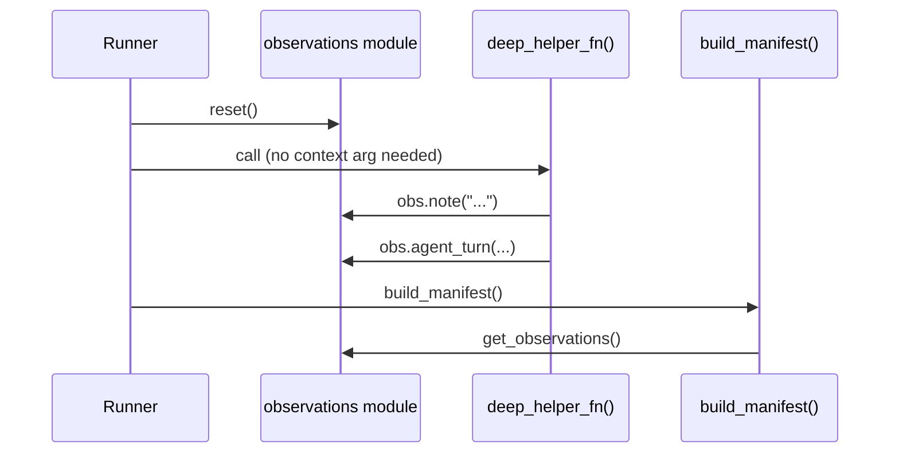

# ADR-005: Module-Level Global State for Observations

**Status:** Accepted
**Date:** 2026-06-07

---

## Context

Scenarios (and the components they call) need to record observations — notes, warnings, agent turns, config notes, metric events — during a run. These observations are collected and embedded into the `RunManifest` at the end of the run.

The challenge is how to make the observation API ergonomic for user code without requiring that a context object be passed through every function call. User scenario code may call helper functions, third-party wrappers, or deeply nested components that all need access to the observation sink.

---

## Decision

Use **module-level global state** in `adgtk.tracking.observations` to hold the current run's observations. The API is a set of module-level functions (`obs.note()`, `obs.warn()`, `obs.agent_turn()`, etc.) that append to a global list. The runner resets this list before each run.

```python
# In any user code, no context object needed:
import adgtk.tracking.observations as obs

obs.note("Loading dataset...")
obs.agent_turn(prompt=p, response=r, tokens_in=100, tokens_out=200, latency_ms=450)
obs.warn("Unexpected null in row 42, skipping")
```



---

## Rationale

- **Zero-boilerplate ergonomics.** User code can call `obs.note()` from any depth of the call stack without threading a context object through every function signature.
- **ADGTK runs are single-threaded per process.** A single experiment run owns the process; there is no concurrency concern with the global list within a run.
- **Explicit reset boundary.** The runner calls `reset()` before every run, making the state boundary clear and predictable.
- **Familiar pattern.** Python's standard `logging` module uses the same module-level sink pattern. Researchers familiar with `logging.info()` understand this immediately.

---

## Alternatives Considered

| Alternative | Why Rejected |
|-------------|-------------|
| Pass a context/collector object through all function signatures | Ergonomically burdensome; forces user code to accept and thread a framework object |
| Return observations from `run_scenario()` | Requires user to accumulate observations and return them; doesn't work for observations from helper functions or third-party code |
| Thread-local storage | Adds complexity for no benefit; ADGTK runs are single-threaded |
| Dependency injection container | Over-engineered for this use case; steeper learning curve |

---

## Consequences

- **Positive:** Observation calls are one-liners from anywhere in user code.
- **Positive:** No framework objects leak into user scenario signatures.
- **Negative:** Module-level state is a global side effect. If two experiments were to run concurrently in the same process, observations would intermix. The framework currently prevents this — each CLI invocation runs one experiment; the web server and MCP server serialize experiment execution.
- **Negative:** Unit testing user code that calls `obs.*` requires either calling `reset()` in test setup or importing the observations module to inspect state.

---

## Related Decisions

- [ADR-004](ADR-004-pydantic-validation.md) — `AnyObservation` types are Pydantic models
- [ADR-003](ADR-003-filesystem-tracking.md) — Observations are embedded in `RunManifest` and persisted to disk
