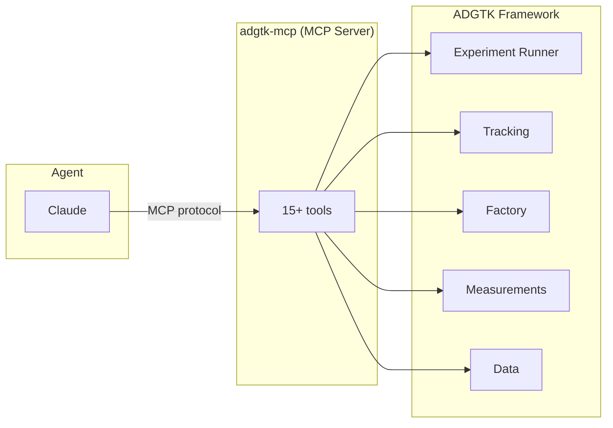

# ADR-006: MCP Server for Agent Integration

**Status:** Accepted
**Date:** 2026-06-07

---

## Context

ADGTK is designed to evaluate and support agentic AI systems. A natural extension is to allow AI agents to *operate* ADGTK — discovering experiments, running them, retrieving results, and using those results to make decisions — all without human intervention. This requires a machine-readable interface to the framework.

The options are: a REST API, a Python SDK, a CLI wrapper, or a protocol-native integration with AI agents.

---

## Decision

Expose ADGTK's capabilities as **MCP (Model Context Protocol) tools** via the `adgtk-mcp` server. MCP is the protocol used by Claude and other AI agents for tool use. This makes ADGTK a first-class tool provider for AI agents without requiring any prompt engineering or API wrapping.

**Available tool categories:**

| Category | Tools |
|----------|-------|
| Project | `project_status` |
| Experiments | `list_experiments`, `run_experiment`, `generate_experiment_report`, `copy_experiment` |
| Batches | `list_batches`, `run_batch` |
| Results | `list_runs`, `get_run_details`, `export_results`, `validate_results` |
| Studies | `list_studies`, `run_study` |
| Factory | `list_components` |
| Datasets | `list_datasets` |

---

## Rationale

- **Protocol-native.** MCP is the standard tool protocol for Claude. Using it means zero friction for Claude-based agents — no prompt engineering to parse CLI output, no HTTP client code.
- **Consistent with framework purpose.** ADGTK evaluates agents; making ADGTK operable by agents is a natural "eat your own cooking" design.
- **Reuses existing internals.** The MCP server is a thin adapter over the same runner, tracking, and factory APIs used by the CLI and web interface. No duplication.
- **Composable agentic workflows.** An agent can `list_experiments()`, choose based on tags, `run_experiment()`, receive the manifest, inspect metrics, then decide whether to adjust and re-run — all without human input.

---

## Alternatives Considered

| Alternative | Why Rejected |
|-------------|-------------|
| REST API only | Would require building an HTTP client and request/response parsing into every agent prompt |
| Python SDK for agents | Only works for agents that run Python; MCP is language-agnostic |
| CLI subprocess wrapper | Fragile; requires parsing stdout; harder to pass structured data |
| Webhooks / callbacks | Reactive model doesn't fit tool-use agents well |

---

## Consequences

- **Positive:** Claude and other MCP-compatible agents can operate the full ADGTK workflow without human mediation.
- **Positive:** The MCP server exposes the same framework capabilities as the CLI and web UI — one implementation, three interfaces.
- **Positive:** Agent-driven experiment orchestration becomes a first-class scenario pattern.
- **Negative:** The MCP server is a long-running process; it bootstraps the factory once at startup. If new components are registered in `bootstrap.py`, the server must restart.
- **Negative:** MCP is a relatively new protocol; tooling and debugging support are still maturing.

---

## Related Decisions

- [ADR-001](ADR-001-non-persistent-factory.md) — Factory is bootstrapped once at MCP server startup
- [ADR-003](ADR-003-filesystem-tracking.md) — MCP tools read from the same filesystem tracking as CLI and web
