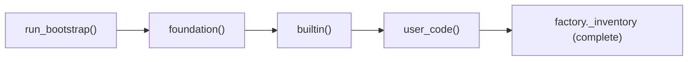

# ADR-008: Per-Process Bootstrap Registration

**Status:** Accepted
**Date:** 2026-06-07

---

## Context

The factory registry is non-persistent (see [ADR-001](ADR-001-non-persistent-factory.md)) — it must be populated on every process start. The framework ships with built-in components (measurements, example scenarios) and also needs to load user-defined components. The order of registration matters: built-ins must be available before user code runs, and user code must be able to override built-ins.

---

## Decision

Every ADGTK process calls `run_bootstrap()`, which invokes three ordered hooks from the project's `bootstrap.py` file:

```python
# Project's bootstrap.py (user-authored):

def foundation():
    """Register language primitives and core framework infrastructure."""
    import adgtk.factory as factory
    factory.register(StringType)
    factory.register(IntType)
    # ...

def builtin():
    """Register framework-provided scenarios, measurements, datasets."""
    from adgtk.measurements.builtin import register_all_measurements
    register_all_measurements()
    # ...

def user_code():
    """Register user-defined components."""
    from my_project.scenarios import MyScenario
    factory.register(MyScenario)
    # ...
```



The `adgtk-project` command generates the initial `bootstrap.py` with all three hooks as empty stubs, ready for the user to fill in.

---

## Rationale

- **Ordered, explicit.** The three-phase ordering ensures that lower-level primitives are always available when higher-level components are registered.
- **User control.** User code runs last, so it can override any built-in registration if needed (e.g., replace a built-in measurement with a custom version).
- **Single source of truth.** All registrations live in one file (`bootstrap.py`). There is no scattered `@autodiscover` magic across the codebase.
- **Inspectable.** `adgtk-factory list` shows everything registered and where. Since all registrations flow through `bootstrap.py`, the source is always traceable.
- **Testable.** Unit tests can call only the hooks they need (e.g., just `foundation()`) without loading all user components.

---

## Alternatives Considered

| Alternative | Why Rejected |
|-------------|-------------|
| Single `bootstrap()` function | No ordering guarantee between built-ins and user code; user code could accidentally run before framework setup |
| Auto-discovery (scan for `SupportsFactory` subclasses) | Non-deterministic; registers unintended classes; harder to debug |
| `setup.cfg` / `pyproject.toml` entry points | Requires package installation; too slow for research iteration; complex for non-package projects |
| Decorators at module import time | Registration happens when the module is imported, which may be before or after framework setup depending on import order |

---

## Consequences

- **Positive:** All component registration is visible in a single file, making the project's component inventory easy to audit.
- **Positive:** The three-phase structure allows the framework to guarantee built-in availability without any import-order tricks.
- **Positive:** Users can add components by adding three lines to `bootstrap.py` — one import, one `register()` call. No config files, no decorators in the class definition required.
- **Negative:** Every project must maintain a `bootstrap.py`. The scaffold generator (`adgtk-project`) provides the template, but the file must be kept up to date as components are added.
- **Negative:** Long-running services (web server, MCP server) bootstrap once and cannot pick up new registrations without a restart.

---

## Related Decisions

- [ADR-001](ADR-001-non-persistent-factory.md) — The factory that bootstrap populates
- [ADR-007](ADR-007-protocol-based-typing.md) — Protocols that registered components must satisfy
