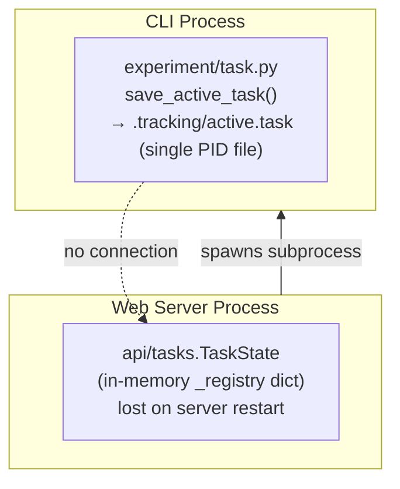
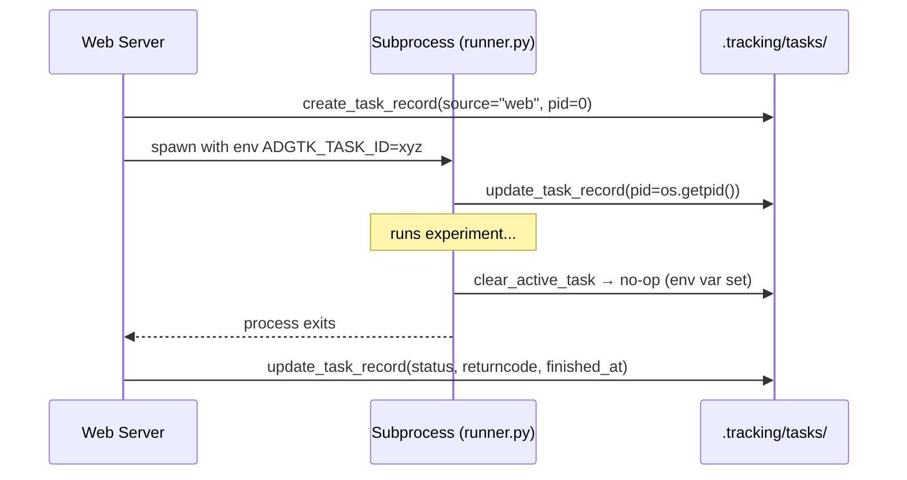
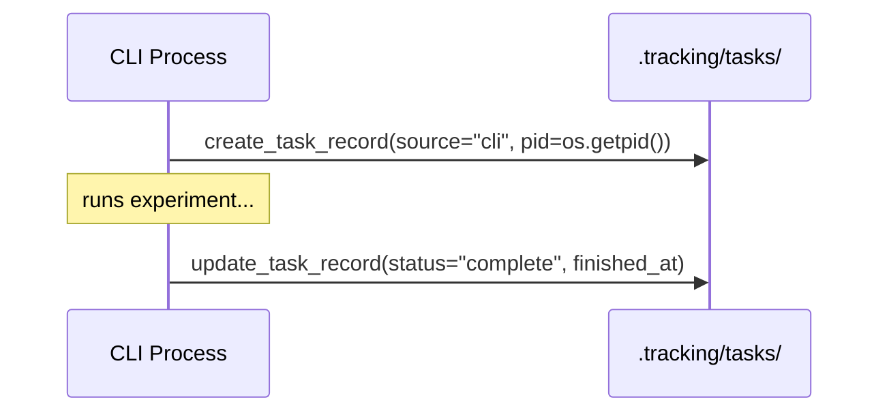

# ADR-009: Unified Task Record with Per-Task Output Log

**Status:** Accepted
**Date:** 2026-06-07
**Amended:** 2026-06-07 (rec 1.2 — added `run_id` field; `create_task` now accepts bare `experiment_name`)
**Supersedes:** active.task single-file approach (see ADR-003)

---

## Context

ADGTK has two disconnected task-tracking systems that cannot see
each other:



**Consequences of the split:**

- The web `_registry` is lost on server restart; there is no record
  of what previously ran.
- The CLI's `.tracking/active.task` PID file is written by the
  subprocess but the web server never reads it to enrich `TaskState`.
- Orphaned PID files from crashed experiments are only cleaned up
  reactively when `task_safe_to_start()` is called next.
- The CLI has no visibility into tasks the web server launched.
- The TODO items for "web view of active task", "CLI stop command",
  and "orphan cleanup" (items 4.1–4.4) all require this to be
  addressed first.
- Subprocess output captured by `api/tasks.run_subprocess` exists
  only in `task.lines` (in-memory) and is lost if the server
  restarts mid-run or after completion.

---

## Decision

Replace the single `active.task` PID file and the in-memory
`_registry` dict with a **per-task directory** under
`.tracking/tasks/`.  Each task directory holds two files:

```
.tracking/
  tasks/
    {task_id}/
      record.json   ← TaskRecord (status, pid, timestamps, returncode)
      output.log    ← captured stdout/stderr, one line per entry
```

`record.json` is written by both the CLI runner and the web server.
`output.log` is appended line-by-line as the subprocess produces
output; it is also readable after completion for log replay.

### TaskRecord model

```python
class TaskRecord(BaseModel):
    task_id: str
    experiment_name: str   # bare name, e.g. "exp.1.0" (not "run: exp.1.0")
    label: str
    status: Literal["running", "complete", "error", "stopped"]
    pid: int
    source: Literal["cli", "web"]
    started_at: datetime
    finished_at: Optional[datetime] = None
    returncode: Optional[int] = None
    run_id: Optional[str] = None  # set after successful completion (rec 1.2)
```

`run_id` is populated by `_find_run_id()` in `api/tasks.py` after the subprocess exits with returncode 0. It is the name of the newest directory under `results/{experiment_name}/` created since the task started. Storing it in `TaskRecord` allows the task detail page to link to the report after a server restart.

### Per-task directory

Individual directories (rather than a shared `tasks.json`) avoid
write contention between a CLI process and the web server.  Listing
all tasks is a directory glob; reading one task is a single file
read.

### ADGTK_TASK_ID environment variable

When the web server spawns a subprocess it sets
`ADGTK_TASK_ID=<task_id>` in the child's environment.  This
coordinates two processes that both call `save_active_task()` without
creating duplicate records:



Responsibility split:
- **Web** creates the record and writes the final status/returncode
  after `proc.wait()`.
- **Subprocess** updates only the PID (so the record reflects the
  real process ID for orphan detection).
- **Web** appends each captured line to `output.log` in
  `run_subprocess`.

### CLI direct path

When there is no `ADGTK_TASK_ID` env var, `save_active_task()`
creates a new `TaskRecord` (`source="cli"`) and `clear_active_task()`
writes the final status.  Output is not captured to `output.log` on
the CLI direct path (output goes to the terminal).



### Orphan cleanup

`cleanup_orphaned_tasks()` scans all records with
`status="running"` and calls `is_process_running(record.pid)`.
Any record whose PID is dead is updated to `status="error"`.
This is called:

1. Inside `task_safe_to_start()` — before every new run.
2. At web-server startup — as part of the lifespan handler.

### Legacy migration

`_migrate_legacy_active_task()` in `task_record.py` converts a
pre-ADR-009 `.tracking/active.task` file to an `error` TaskRecord
on first invocation and deletes the legacy file.  It is called at
the top of `cleanup_orphaned_tasks()` so it runs automatically
without a separate migration step.

---

## Rationale

- **Single source of truth.** `record.json` is readable by the CLI,
  the web server, and any future interface without process
  coordination.
- **No write contention.** Each task owns its directory; concurrent
  writes are impossible by construction.
- **Durable output.** `output.log` survives server restarts, enabling
  log replay for completed tasks (required by recommendation 2.1).
- **Orphan safety.** PID-based liveness checks convert stale records
  to `error` automatically — no manual cleanup required.
- **Audit trail.** The directory structure is human-inspectable with
  any text editor and git-ignorable for large outputs.
- **Consistent with ADR-003.** Follows the same filesystem-first,
  no-database principle established for run results.

---

## Alternatives Considered

| Alternative | Why Rejected |
|-------------|-------------|
| Single `tasks.json` append-log | Concurrent writes from CLI and web require locking; harder to read individual records |
| SQLite database | Contradicts ADR-003 principle of no infrastructure dependency |
| Keep in-memory registry, add persistence on shutdown | Does not survive crashes; still no CLI visibility |
| Pass `run_id` instead of `task_id` to subprocess | `run_id` is not known until after the experiment starts; `task_id` is created before launch |

---

## Consequences

- **Positive:** CLI and web tasks are visible to both interfaces
  through a shared directory.
- **Positive:** Output survives restarts; log replay is a file read.
- **Positive:** Orphan detection is O(n) over task directories —
  acceptable at research scale.
- **Positive:** Legacy `active.task` files are migrated transparently.
- **Negative:** `TaskState` (in-memory, for SSE streaming) and
  `TaskRecord` (on-disk) are separate objects that must be kept in
  sync.  This is by design — `lines` and `proc` are transient and
  intentionally excluded from the durable record.
- **Negative:** CLI direct path does not capture output to
  `output.log`.  Output goes to the terminal only.  Log replay after
  CLI runs is therefore not available.  This is acceptable because
  CLI users can see output live; replay is primarily a web concern.

---

## Related Decisions

- [ADR-003](ADR-003-filesystem-tracking.md) — filesystem-first
  tracking; `.tracking/tasks/` follows the same principle
- [ADR-004](ADR-004-pydantic-validation.md) — `TaskRecord` is a
  Pydantic model
- [ADR-001](ADR-001-non-persistent-factory.md) — `TaskState` remains
  in-memory (non-persistent) for SSE streaming
