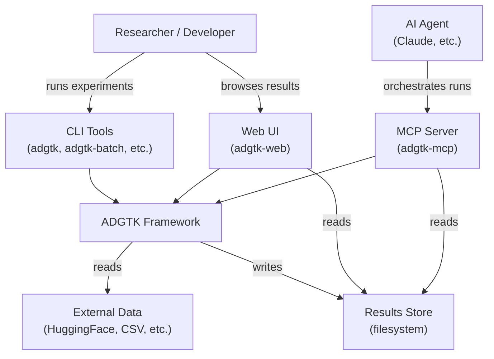
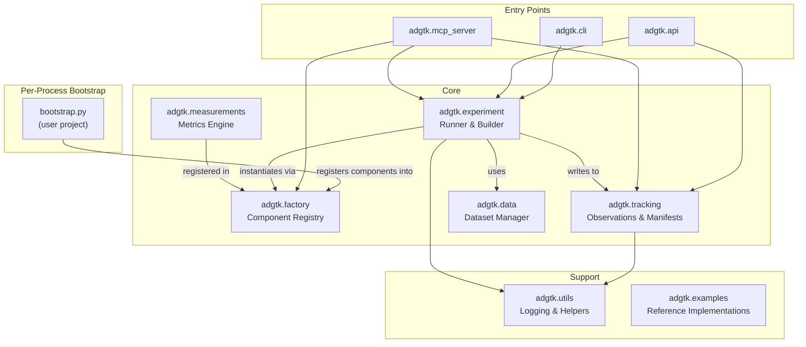
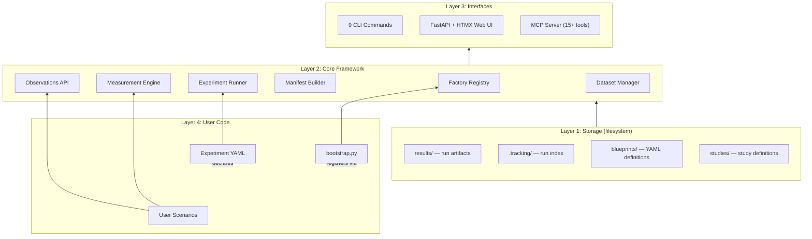

# ADGTK System Architecture Overview

**Version:** 0.3.0b0
**Last Updated:** 2026-06-07 (updated: rec 1.1 filesystem layout, rec 1.2 task page)

---

## Purpose

ADGTK (Agent Development & General Testing Kit) is a framework for designing, running, and analyzing experiments on agentic AI systems. It provides a structured approach to reproducible experimentation: define a scenario in YAML, run it, and get a canonical record of what happened — observations, metrics, and artifacts — stored as plain files.

---

## System Context



---

## Module Map



---

## Layered Architecture



---

## Key Design Principles

| Principle | How It Is Applied |
|-----------|-------------------|
| **Reproducibility** | Every run snapshots its exact YAML config alongside results |
| **Transparency** | The observations API creates a structured "lab journal" for each run |
| **Extensibility** | Factory pattern enables pluggable scenarios, measurements, and datasets without framework changes |
| **Simplicity** | Non-persistent factory, YAML-first definitions, plain-filesystem tracking — no database required |
| **Agentic First** | `AgentWriter`, MCP server, and `agent_turn()` observation type are first-class citizens |
| **Type Safety** | Pydantic validates all external data; `Protocol` classes enforce interfaces without inheritance |

---

## Filesystem Layout

```
{project-root}/
├── bootstrap.py              ← user code: registers components into the factory
├── blueprints/               ← YAML experiment definitions
│   └── my-experiment.yaml
├── studies/                  ← YAML study (multi-experiment) definitions
├── results/                  ← auto-generated run output
│   └── {experiment_name}/
│       ├── common/                   ← shared experiment-level data
│       └── {run_id}/
│           ├── run.exp.config.yaml       ← exact config snapshot
│           ├── conclusions/
│           │   ├── run.manifest.json     ← canonical run record
│           │   ├── report.md             ← human-readable report
│           │   └── results.yaml          ← quick-reference summary
│           ├── metrics/
│           │   └── {tracker}.{label}.csv
│           ├── llm/
│           │   ├── chat.log              ← ANSI-colored LLM conversation
│           │   └── chat.jsonl            ← NDJSON sidecar for web rendering
│           ├── datasets/
│           ├── images/
│           ├── models/
│           └── other/
├── logs/                     ← framework and run logs
│   ├── framework/
│   │   └── adgtk.project.log         ← rotating framework log (5 MB / 3 backups)
│   └── runs/
│       └── {experiment_or_batch}/
│           ├── scenario.log           ← per-run scenario log
│           └── batch.log              ← batch run summary (batch jobs only)
├── settings.yaml             ← user-configurable project settings (auto-created)
├── study-results/            ← cross-experiment aggregated results
└── .tracking/                ← runtime registries
    ├── runs.json             ← index of all completed runs
    ├── project.json          ← experiment inventory
    ├── prefix.json           ← run ID prefix config
    └── tasks/                ← per-task records (ADR-009)
        └── {task_id}/
            ├── record.json   ← TaskRecord (status, pid, timestamps, run_id)
            └── output.log    ← captured stdout/stderr (web-launched tasks)
```

---

## Technology Stack

| Layer | Technology |
|-------|-----------|
| Language | Python ≥ 3.12 |
| Data Validation | Pydantic |
| Config Format | YAML |
| Web Server | FastAPI + Uvicorn |
| Web Templates | Jinja2 + HTMX |
| Agent Integration | MCP (Model Context Protocol) |
| Data | HuggingFace `datasets`, pandas |
| CLI | prompt-toolkit |
| Testing | pytest, mypy, flake8, tox |

---

## Related Documents

- [Component Architecture](components.md)
- [Data Flow](data-flow.md)
- [Decisions Index](decisions/index.md)
